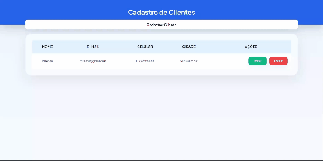

# Cadastro de Clientes (CRUD) 

Aplicação de cadastro de clientes com operações completas de Create, Read, Update e Delete, desenvolvida com HTML, CSS e JavaScript puro.

Veja o projeto <a href="https://milennafeijo.github.io/cadastro-de-clientes-crud/"> aqui </a> 

## Funcionalidades

• Cadastrar novo cliente via modal  
• Listar clientes em tabela dinâmica  
• Editar dados de um cliente existente  
• Excluir cliente  
• Persistência de dados com localStorage  
• Layout responsivo para mobile, tablet e desktop  

## O que aprendi

• Manipulação do DOM com JavaScript  
• Abertura e fechamento de modais via classList  
• Eventos de clique, submit e teclado  
• localStorage — salvar, buscar e atualizar dados  
• JSON.stringify e JSON.parse  
• Lógica de CRUD com array e índices  
• Responsividade com media queries  
• Uso de IAs [Claude, Copilot e ChatGPT) como ferramenta de apoio ao aprendizado  

## Desafios

• Entender o que cada parte do CRUD realmente faz  
• Controlar o índice correto para editar e excluir o cliente certo  
• Responsividade — transformar a tabela em cards no mobile  

## Tecnologias

• HTML5  
• CSS3  
• JavaScript

 

  

